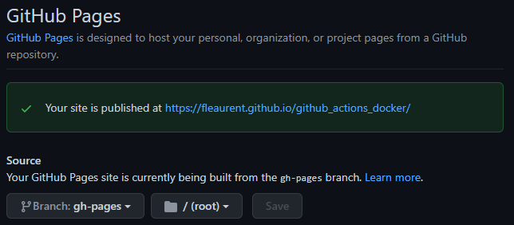

<!-- Badges -->

  

<!-- Main README -->
# Github Actions Docker Doxygen  

- [1. Public Docker Images](#1-public-docker-images)
- [2. Private Docker Images](#2-private-docker-images)
- [3. Publish to GitHub Pages](#3-publish-to-github-pages)

___

## 1. Public Docker Images  

```yml
# This is a basic workflow to help you get started with Actions

name: CI

# Controls when the workflow will run
on:
  # Triggers the workflow on push or pull request events but only for the main branch
  push:
    branches: [ main ]
  pull_request:
    branches: [ main ]

  # Allows you to run this workflow manually from the Actions tab
  workflow_dispatch:

# A workflow run is made up of one or more jobs that can run sequentially or in parallel
jobs:
  # This workflow contains a single job called "build"
  build_job:
    # The type of runner that the job will run on
    runs-on: ubuntu-latest

    # Steps represent a sequence of tasks that will be executed as part of the job
    steps:
      # Checks-out your repository under $GITHUB_WORKSPACE, so your job can access it
      - uses: actions/checkout@v2

      # Runs a single command using the runners shell
      - name: Run a one-line script
        run: echo Hello, world!

      # Runs a set of commands using the runners shell
      - name: Run a multi-line script
        run: |
          echo Add other actions to build,
          echo test, and deploy your project.
          
  vm_job:
    runs-on: ubuntu-latest
    steps:
      - name: Run on VM
        run: |
          echo This job does not specify a container.
          echo It runs directly on the virtual machine.
        
        
  container_job:
    runs-on: ubuntu-latest
    container: node:10.16-jessie
    steps:
      - name: Run in container
        run: |
          echo This job does specify a container.
          echo It runs in the container instead of the VM.
        
```

___

## 2. Private Docker Images  

https://stackoverflow.com/questions/64033686/how-can-i-use-private-docker-image-in-github-actions  
&rarr; using github container registry ghcr.io  

1. generate token  
  &rarr; DOCKER_CONTAINER_REGISTRY_TOKEN  
2. save token as a repository secret  
  &rarr; DOCKER_CONTAINER_REGISTRY_TOKEN  
3. put token in computers environment  
  `$ export DOCKER_CONTAINER_REGISTRY_TOKEN=<token>`  
4. push docker image to `ghcr.io/<YOUR_USERNAME>/<IMAGE_NAME>:<IMAGE_TAG>`  
  `$ echo $DOCKER_CONTAINER_REGISTRY_TOKEN | docker login ghcr.io -u <YOUR_USERNAME> --password-stdin`  
  `$ make build_image`  
  `$ docker tag doxygen_image:latest ghcr.io/fleaurent/doxygen_image:latest`  
  `$ docker push ghcr.io/fleaurent/doxygen_image:latest`  
5. add github action using the custom image  

```yml
# The job that will use the container image you just pushed to ghcr.io
custom_container_job:
  runs-on: ubuntu-18.04
  container:
    image: ghcr.io/<YOUR_USERNAME>/<IMAGE_NAME>:<IMAGE_TAG>
    credentials:
      username: <YOUR_USERNAME>
      password: ${{  secrets.DOCKER_CONTAINER_REGISTRY_TOKEN }}
  steps:
    - name: run in custom container
      shell: bash
      run: |
        # Whatever commands you want to run here using the container with your new Docker image at ghcr.io!
        echo "--This is running in my custom Docker image--"
```

___

## 3. Publish to GitHub Pages

https://docs.github.com/en/pages/getting-started-with-github-pages/configuring-a-publishing-source-for-your-github-pages-site  

https://time2hack.com/auto-publish-github-pages-github-actions/  

https://github.com/peaceiris/actions-gh-pages  

1. update image: install git-lfs  
   https://github.com/git-lfs/git-lfs/issues/4346
   `Dockerfile`  

```bash
FROM alpine:latest

RUN apk --update add doxygen graphviz git git-lfs &&\
    rm -rf /var/cache/apk/*

CMD ["doxygen", "-v"]

WORKDIR /tmp
```

2. build and push the image  

```bash
$ docker build -t doxygen_image .
$	docker tag doxygen_image:latest ghcr.io/fleaurent/doxygen_image:latest
$ docker push ghcr.io/fleaurent/doxygen_image:latest
```

3. update the github action  

`publish_github_pages.yml`  

```yml
name: Publish_Github_Pages_CI

on:
  push:
    branches: [ main ]

jobs:
  deploy_job:  
    runs-on: ubuntu-latest  # ubuntu-22.04
    
    container:
      image: ghcr.io/fleaurent/doxygen_image:latest
      credentials:
        username: fleaurent
        password: ${{  secrets.DOCKER_CONTAINER_REGISTRY_TOKEN }}
        
    steps:
      - uses: actions/checkout@v2
      
      - name: generate documentation
        run: doxygen Doxyfile
        
      - name: copy documentation to the build directory
        run: cp -r html/ build/
        
    # Push the HTML files to github-pages
      - name: GitHub Pages action
        uses: peaceiris/actions-gh-pages@v3
        with:
          github_token: ${{ secrets.GITHUB_TOKEN }}
          publish_dir: ./build
```

4. set up github pages in the github repository:  
  the files are pushed to a separate branch `gh-pages`  
    

&rarr; [GitHub Pages](https://fleaurent.github.io/github_actions_docker/)  
